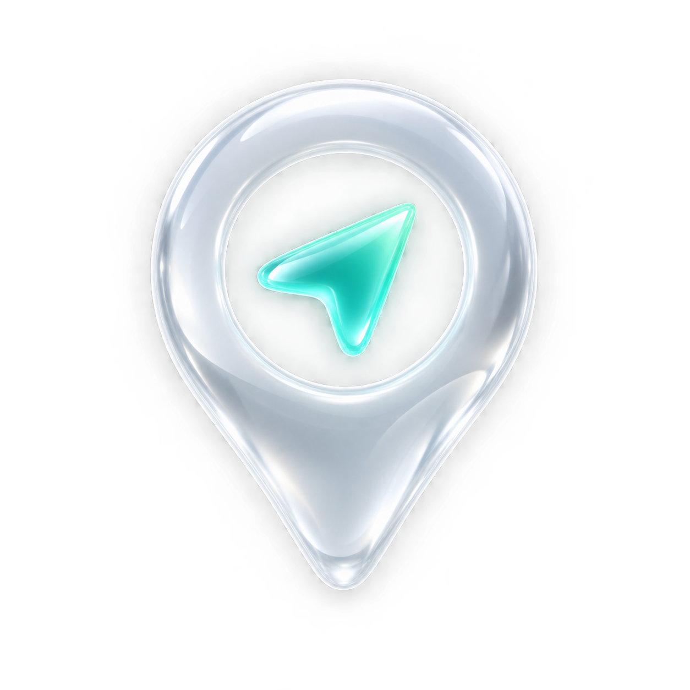

<p align="center"></p>
<h1 align="center">Pinshift</h1>
<p align="center">Choose a location on your iPhone. Your Mac takes it from there.</p>

Pinshift is a free, MIT-licensed fork of [GeoShift](https://github.com/Lemelson/GeoShift), rebuilt with an English-only SwiftUI interface and a native iPhone remote.

- Search a city, address, landmark, or coordinates, or tap anywhere on the map.
- Start location simulation and restore real GPS with one button.
- Control the Mac from an iPhone on the same local Wi-Fi network.
- Pair using a private QR code; commands and status use authenticated, encrypted TLS.
- Close the Mac window and keep controlling it through the menu bar and companion.
- Save favorite places on the Mac. Select the exact target if multiple iPhones are connected.

## Get started

1. Build and open **Pinshift** on your Mac.
2. Connect the target iPhone to Xcode, trust the Mac, and enable Developer Mode on the phone. Set up Xcode's network connection if you want to unplug USB.
3. Build and install the **PinshiftRemote** target on your iPhone.
4. Keep both devices on the same Wi-Fi. On the Mac, click **Pair iPhone remote**; on the iPhone, tap **Scan Mac’s QR code**. Allow Local Network access when asked.
5. Choose a location on the phone and tap **Start location**. Tap **Stop & restore GPS** when finished.

The companion sends commands to the Mac. It does not simulate location on its own. The Mac must be awake, Pinshift must remain running, and Xcode must be able to reach the target iPhone. The location worker prevents idle sleep while active; closing a laptop lid still interrupts connectivity.

## Requirements

- macOS 14 or later; iPhone companion requires iOS 18 or later.
- Full Xcode with `devicectl device simulate location` support. Development was verified with Xcode 26.6 and a trusted iPhone running iOS 27. Check the command below before installing.
- A development signing team to install the companion on a physical iPhone. Apple controls the availability, limits, and validity of development provisioning.
- A local network that permits Bonjour discovery and connections between devices. Guest networks with client isolation may prevent pairing.

```sh
xcrun devicectl device simulate location --help
```

An App Store installation is not provided. Pinshift has no subscription, license key, or paid service. It does not change GPS hardware, and individual apps may ignore or reject simulated locations; compatibility with Pokémon GO is not guaranteed.

## Build

Open `Pinshift.xcodeproj` in Xcode. Select your signing team for the iPhone target and change bundle identifiers if needed. Run **Pinshift** on My Mac, and **PinshiftRemote** on your iPhone.

The generated Xcode project is committed, so XcodeGen is only needed when changing `project.yml`:

```sh
brew install xcodegen
xcodegen generate
```

Build and install a local Mac app:

```sh
Scripts/install_app.sh
```

This creates a locally signed development build at `/Applications/Pinshift.app`. It is not notarized for public distribution. A distributable release needs your own Developer ID signing and notarization.

## Development and tests

```sh
python3 -m unittest discover -s Tests/Python -v
xcodebuild -project Pinshift.xcodeproj -scheme Pinshift \
  -destination 'platform=macOS' CODE_SIGN_IDENTITY=- test
```

The worker uses Python's standard library and Apple's native CoreDevice commands; no Python package, root tunnel, cloud account, or public server is needed. The Xcode installation supplies `/usr/bin/python3`.

See [architecture and protocol](docs/ARCHITECTURE.md), [privacy](docs/PRIVACY.md), [troubleshooting and removal](docs/TROUBLESHOOTING.md), and [logo source](docs/DESIGN.md).

## Attribution

Based on GeoShift by Lemelson, especially its durable location recovery and application-liveness design. The original MIT copyright and license are retained in [LICENSE](LICENSE). Pinshift adds the native CoreDevice backend, map UI, branding, encrypted local protocol, and iOS companion. Upstream history remains in this fork.
